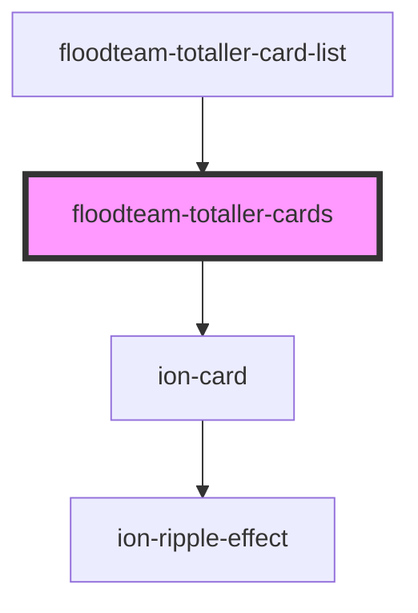

# floodteam-totaller-cards

<!-- Auto Generated Below -->

## Properties

| Property     | Attribute     | Description | Type                          | Default     |
| ------------ | ------------- | ----------- | ----------------------------- | ----------- |
| `totallerId` | `totaller-id` |             | `string`                      | `undefined` |
| `totals`     | --            |             | `{ [sumName: string]: any; }` | `undefined` |

## Events

| Event            | Description | Type                               |
| ---------------- | ----------- | ---------------------------------- |
| `fireenjinFetch` |             | `CustomEvent<FireEnjinFetchEvent>` |

## Dependencies

### Used by

 - [floodteam-totaller-card-list](../totaller-card-list)

### Depends on

- ion-card

### Graph

----------------------------------------------

*Built with [StencilJS](https://stenciljs.com/)*
