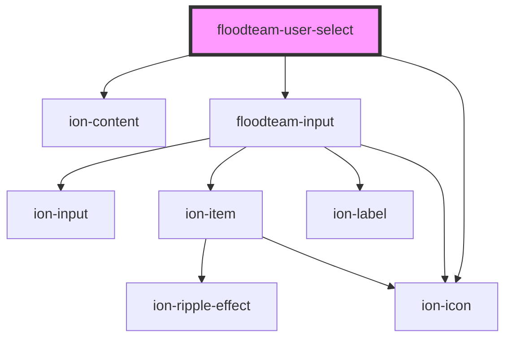

# floodteam-user-select

<!-- Auto Generated Below -->

## Properties

| Property        | Attribute        | Description                                        | Type      | Default     |
| --------------- | ---------------- | -------------------------------------------------- | --------- | ----------- |
| `delay`         | `delay`          | How long to delay after input before searching     | `number`  | `1000`      |
| `disabled`      | `disabled`       | Whether or not the search input is disabled        | `boolean` | `false`     |
| `emailRequired` | `email-required` | Is the email required in order to select result    | `boolean` | `false`     |
| `loading`       | `loading`        | Whether or not the loader is showing               | `boolean` | `false`     |
| `query`         | `query`          | The search query to fill into the input            | `string`  | `undefined` |
| `records`       | --               | A list of user records that match the search query | `any[]`   | `[]`        |
| `user`          | `user`           | The user currently selected                        | `any`     | `undefined` |

## Events

| Event      | Description                                                   | Type                                          |
| ---------- | ------------------------------------------------------------- | --------------------------------------------- |
| `ftLoad`   | Emitted when the component loads                              | `CustomEvent<any>`                            |
| `ftSearch` | Emitted when the user submits the search form or after typing | `CustomEvent<{ event: any; query: string; }>` |
| `ftSelect` | Emitted when the user submits the search form or after typing | `CustomEvent<{ event: UIEvent; user: any; }>` |

## Methods

### `reset() => Promise<boolean>`

Reset the field

#### Returns

Type: `Promise<boolean>`

### `setResults(records: any[]) => Promise<any[]>`

Set search results with list of users

#### Returns

Type: `Promise<any[]>`

### `setUser(user: any, event?: UIEvent) => Promise<any>`

Set selected user

#### Returns

Type: `Promise<any>`

## Dependencies

### Depends on

- ion-content
- [floodteam-input](../input)
- ion-icon

### Graph

----------------------------------------------

*Built with [StencilJS](https://stenciljs.com/)*
